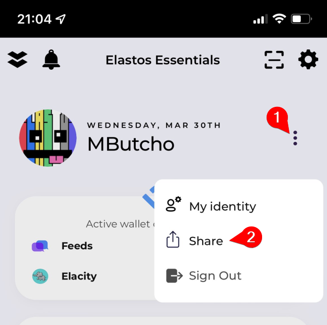

# Create new proposal

Users who activated their account are able to create e-lab proposal and must follow these steps:

1. Create a suggestion draft on [Cyber Republic / Suggestions](https://www.cyberrepublic.org/suggestion/create) page (do not sign it yet with Elastos Essential)
   * Suggestion **must** include at least 2 milestones:
     1. Project Initiation Payment with amount
     2. Project Completion Payment with amount
2. Create new proposal on [E-Lab / My proposals](https://e-lab.io/proposals/my-proposals) page\
   
3. Send new message in [🌐 Projects / 𝐄┃e-lab](https://discord.gg/pnwm6equkt) channel on Official Elastos server about your new proposal and mention **@Guardians** role
4. Guardians review **E-Lab proposal** and **CR suggestion**
5. Guardians will:
   * ask proposer to adjust CR suggestion if needed
   * deny the proposal if:&#x20;
     * doesn’t contain necessary information&#x20;
     * doesn’t comply with E-Lab [rules.md](introduction/rules.md "mention")
6. Once proposer and Guardians agree on the final proposal and suggestion wording, the proposer **must sign CR suggestion** so it can not be altered in the future.&#x20;
7. Guardians will **approve E-Lab proposal**&#x20;
8. The proposal will appear in Community Proposal tab on e-lab and will be waiting for next voting period.

