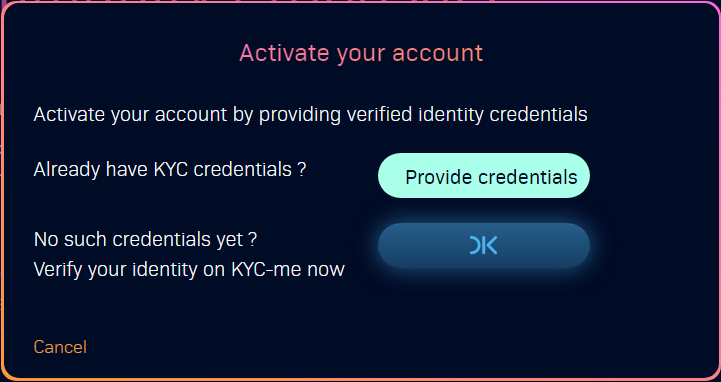

# Account activation

**KYC verification**

In order to [create proposals](../create-new-proposal.md) or [vote on proposals](../vote-on-proposal.md), users must be signed-in [e-lab.io](https://e-lab.io) application via EE and KYC verified via [KYC-me.io](https://kyc-me.io) (KYC service itself is done by 3rd party service [https://passbase.com/](https://passbase.com)).


E-Lab.io - Welcome page


To get KYC verified, please follow this guide on e-lab.io:

1. [sign-in-to-e-lab.io.md](sign-in-to-e-lab.io.md "mention")
2. Click **Activate** on [Welcome ](https://e-lab.io)or [Community Proposals](https://e-lab.io/proposals/community-proposals) page\
   \
   
3. There will be 2 options, either click **Provide credentials** or **OK** to verify via [https://kyc-me.io/](https://kyc-me.io)
   * If you are already KYC verified, click on **Provide credentials** and pick relevant credentials in EE
   * If you are not yet verified, click **OK** and you will be taken to [https://kyc-me.io/](https://kyc-me.io) which will guide you through the KYC process\
     
4. After you KYC verified, click on **Activate** again on [Welcome ](https://e-lab.io)or [Community Proposals](https://e-lab.io/proposals/community-proposals) page and click you will be able to [vote-on-proposal.md](../vote-on-proposal.md "mention")

**Alternatively:** If you do not have passport, please contact us via [about.md](../introduction/about.md "mention") section

