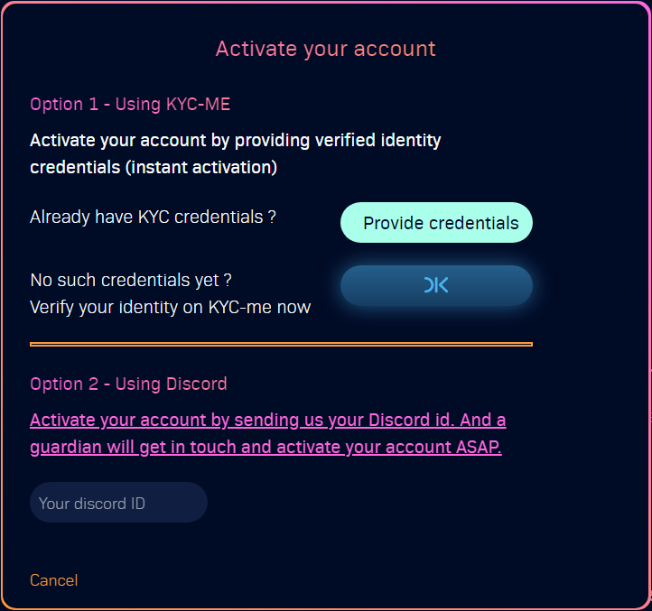
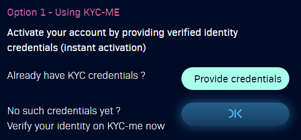
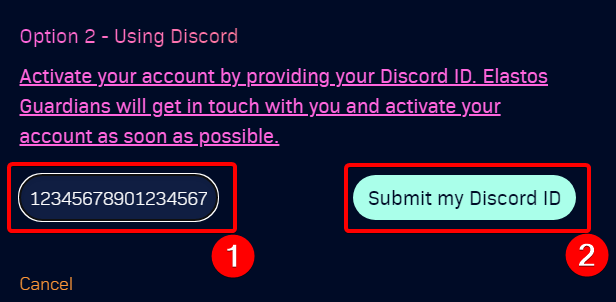

# Account activation

In order to [create proposals](../create-new-proposal.md) or [vote on proposals](../vote-on-proposal.md), users must be signed-in [e-lab.io](https://e-lab.io) application via EE and account has to be activated. There are 2 ways to activate your account, via Discord ID or via KYC.&#x20;


E-Lab.io - Welcome page


To activate your account, please follow this guide:

1. [sign-in-to-e-lab.io.md](sign-in-to-e-lab.io.md "mention")
2. Click **Activate** on [Welcome ](https://e-lab.io)or [Community Proposals](https://e-lab.io/proposals/community-proposals) page\
   
3. There will be 2 options: **Using KYC-ME** or **Using Discord.** Please select option below to continue with activation                                                              



To activate your account via [KYC-me.io](https://kyc-me.io), please continue here:

1. There will be 2 buttons: **Provide credentials** and **OK******
   * If your DID is not yet KYC verified, click **OK** and you will be taken to [KYC-me.io](https://kyc-me.io) which will guide you through the KYC process
   * If you are already KYC verified, please continue with **step 3**.
2. After you KYC verified, click on **Activate** again
3. Click **Provide credentials** in the dialog above
4. Select relevant credentials in EE and confirm with password
5. Your account is activated and you will be able to [vote-on-proposal.md](../vote-on-proposal.md "mention") and [create-new-proposal.md](../create-new-proposal.md "mention")

_<mark style="color:red;">**Please note**</mark><mark style="color:red;">: KYC service itself is done by 3rd party service</mark>_ [_<mark style="color:red;">https://passbase.com/</mark>_](https://passbase.com) _<mark style="color:red;">and</mark> <mark style="color:red;"></mark><mark style="color:red;">**Passport is required**</mark>_




To activate your account via **Discord ID**, please continue here:

1. Retrieve your Discord ID via [this guide](https://www.remote.tools/remote-work/how-to-find-discord-id#tl;dr)
2. Enter your Discord ID in the text box and click **Provide my discord ID**:\
   
3. Join [Elastos Official Discord server](https://discord.gg/elastos)
4. We will get in touch with you and manually activate your account
5. You will be able to [vote-on-proposal.md](../vote-on-proposal.md "mention") and [create-new-proposal.md](../create-new-proposal.md "mention")

_<mark style="color:red;">**Please note:**</mark> <mark style="color:red;"></mark><mark style="color:red;">To speed up activation, please contact us via</mark>_ [about.md](../introduction/about.md "mention")_<mark style="color:red;"></mark>_


