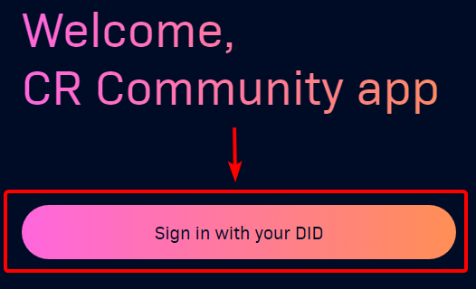

# Sign in to e-lab.io

#### Sign in using Elastos Essentials (EE) 

1. [create-did-in-elastos-essentials.md](create-did-in-elastos-essentials.md "mention")
2. Open [e-lab.io](https://e-lab.io/)
3. Click on Sign in with your DID\
   
4. Open EE and scan QR code provided on E-Lab page\
   
5. Confirm **Name prompt** in EE, which will be provided to E-Lab, otherwise your account will be shown as **Anonymous**

